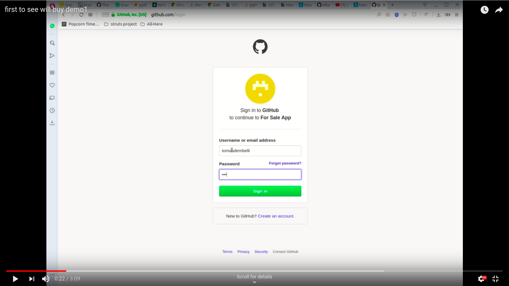

# first_to_see_will_buy
Another second hand stuff selling web site project.

This is a simple django web application which is created for the purpose of practicing while learning this very popular and secure web framework.

Before testing, please check the ".env.example" file and set up the necessary environment and create a new ".env" file with the specific environmental variables.

Following youtube video shows the current status of the project by demonstrating some key features:
- GitHub authentication.
- Public messaging: for giving offers and saving the owner from answering the same questions via private messages.
- Email confirmation at user registration.
- Captcha at signup form.
- Add/remove favorites.
- Unpublish older ads (e.g 2 weeks)

# TODO
- Add Rest Api.
- Create a front end app with React.
